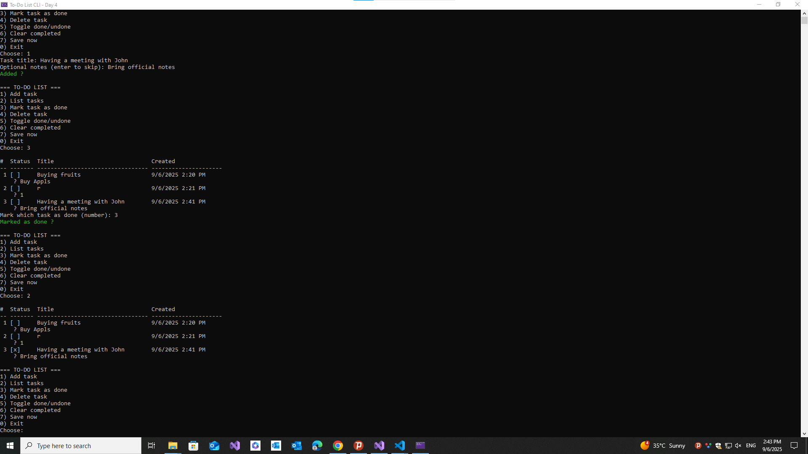

# ✅ To-Do List CLI (C# Console App)

This is **Day 4** of my 30-Day C# Project-Based Learning Plan.  
A simple **command-line To-Do List manager** that lets you add, mark, delete, and save tasks.  
Tasks are stored in a `todo.json` file so they persist between runs.

---

## 🚀 Features
- Add new tasks with optional notes  
- List all tasks in a clean, aligned view  
- Mark tasks as done / toggle undone  
- Delete tasks by number  
- Clear all completed tasks  
- Data persistence with **JSON save/load**  
- Colored output for better UX (warnings, notifications)  

---

## 🛠️ Technologies
- Language: **C#**  
- Framework: **.NET 6/7/8**  
- IDE: Visual Studio  

---

## 📸 Screenshot
| CLI |
|---------------|
|  |

---

## 📚 Learning Goals

This project introduces:

- Collections with List<T>

- Small-scale OOP (TodoItem, TodoStore)

- Input validation with menus

- File persistence using System.Text.Json

- Colored console output (Console.ForegroundColor)
